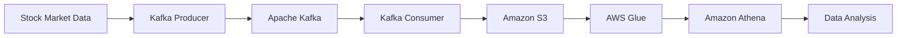

# Real-Time Stock Market Data Pipeline

## Project Architecture
<details>
<summary>Click to view architecture diagram</summary>


</details>

## Project Overview
This project implements a real-time stock market data pipeline using Apache Kafka. The system ingests stock market data, processes it through a Kafka pipeline, and stores it in Amazon S3, making it available for further analysis through Amazon Athena and AWS Glue.

## Architecture Components
- **Data Source**: Stock market data simulation using Python
- **Apache Kafka**: Message broker for real-time data streaming
- **Amazon EC2**: Hosts the Kafka broker
- **Amazon S3**: Data lake storage for raw stock market data
- **AWS Glue**: Data catalog and ETL service
- **Amazon Athena**: SQL query service for analyzing data stored in S3
- **Crawler**: AWS Glue crawler for metadata discovery

## Technologies Used
- Python 3.10
- Apache Kafka
- AWS Services (EC2, S3, Athena, Glue)
- Jupyter Notebook
- pandas
- kafka-python
- s3fs

## Project Setup

### Prerequisites
- AWS Account
- Python 3.x
- Apache Kafka
- Required Python packages:
  ```bash
  pip install kafka-python pandas s3fs
  ```

### Kafka Setup Commands
1. Start Zookeeper:
```bash
bin/zookeeper-server-start.sh config/zookeeper.properties
```

2. Configure Kafka:
```bash
export KAFKA_HEAP_OPTS="-Xmx512M -Xms256M"
```

3. Start Kafka Server:
```bash
bin/kafka-server-start.sh config/server.properties
```

4. Create a Topic:
```bash
bin/kafka-topics.sh --create --topic test --bootstrap-server [EC2-endpoint]:9092 --partitions 1 --replication-factor 1
```

### Running the Project

1. **Start the Producer**:
   - Run `kafkaProducer.ipynb` to start generating and sending stock market data
   - The producer simulates real-time stock market data and sends it to Kafka

2. **Start the Consumer**:
   - Run `kafkaConsumer.ipynb` to start consuming messages
   - The consumer reads data from Kafka and stores it in Amazon S3

## Code Structure
- `kafkaProducer.ipynb`: Contains code for generating and sending stock market data
- `kafkaConsumer.ipynb`: Contains code for consuming data and storing in S3
- `Kafka Commands.txt`: Contains useful Kafka CLI commands

## Data Flow
1. Stock market data is generated/simulated using Python
2. Data is sent to Kafka topic using the Producer
3. Consumer reads data from Kafka topic
4. Data is stored in Amazon S3
5. AWS Glue crawler catalogs the data
6. Data can be queried using Amazon Athena

## Future Improvements
- Add real-time data visualization
- Implement data transformation layers
- Add monitoring and alerting
- Scale the pipeline for higher throughput
- Add error handling and recovery mechanisms

